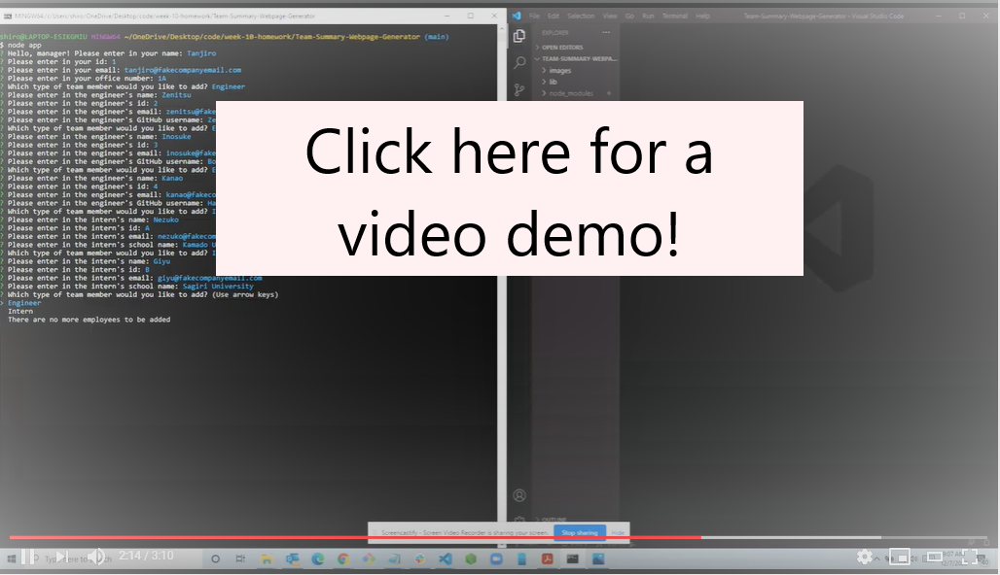
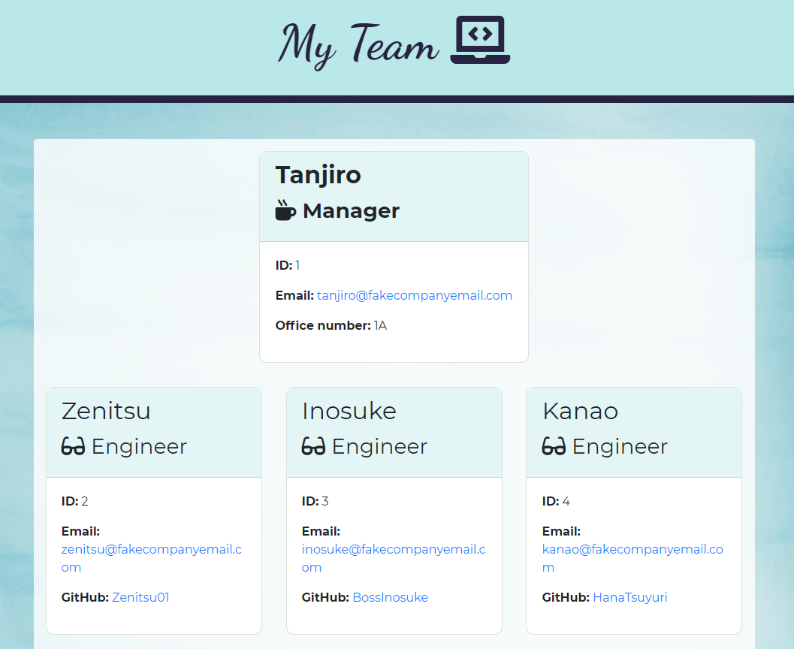
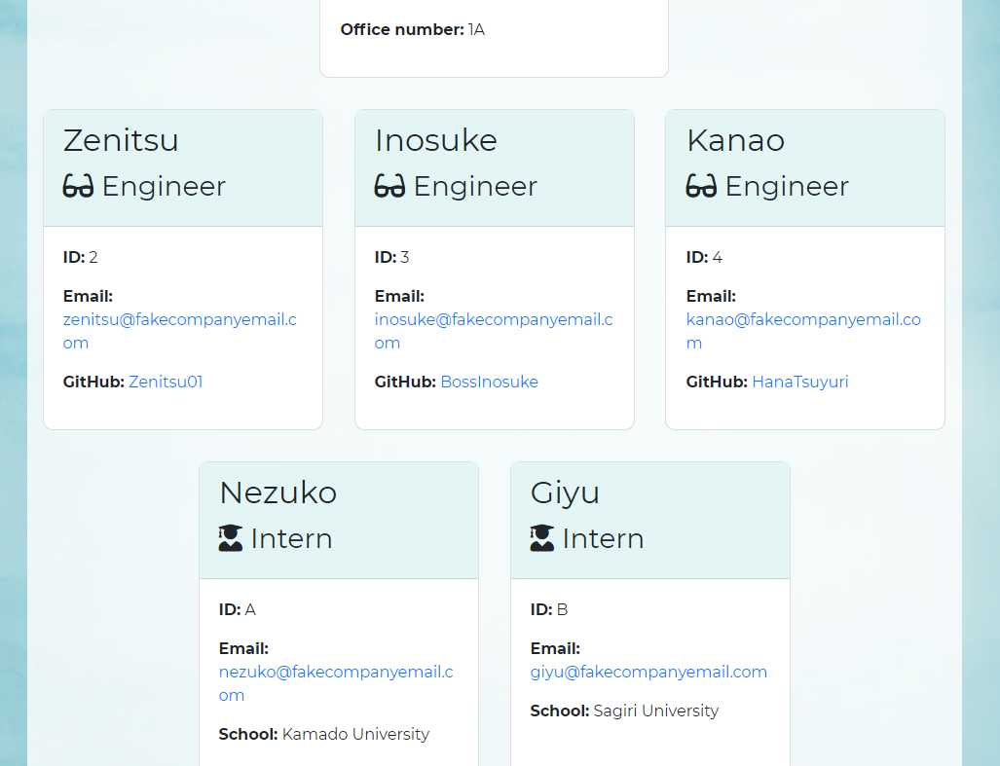

# Team-Summary-Webpage-Generator

***
<p align="center">
  
  
</p>

[](https://opensource.org/licenses/MIT)

Please click on the below screenshot for a video demo on using this application!
[](https://www.youtube.com/watch?v=Yuu0_M6HD2U&feature=youtu.be&ab_channel=Christina2021)

## Table of Contents
* [Description](#description)
* [Installation](#installation)
* [Usage](#usage)
* [Questions](#questions)
* [License](#license)

<br>

## Description
Create a simple webpage with information regarding you and your team!  In the terminal, you will be given a series of questions regarding information about you and your team.  Once you have entered in all of the necessary information, an html file will be generated for your to use as a webpage!
<br>




## Installation
Please see the following commands needed in order to use and run this application:<br>
```bash
npm i
node app
```

## Usage
Please see the following instructions on how to use this application: <br>
⭐Download this directory and navigate into it within your terminal/command line.<br>
⭐This application will require Node.js.  Install Node if you do not already have it installed.<br>
⭐In the terminal, enter in the command "npm i" in order for the appropriate node packages to be utilized (this application uses the following package: inquirer; please also note that the package jest was also used for testing purposes).<br>
⭐In the terminal, enter in the command "node app" or "node app.js" in order for the application to run.<br>
⭐The first handful of prompts will be on information on the manager.<br>
⭐The user will then be given an option to add information for a team member that is either an engineer or an intern.<br>
⭐Once the information on the team member has been entered, the user will continue to be prompted to enter in information for another team member until they no long have any employees to add.<br>
⭐An output folder will generate (if not already generated), and will include a file titled "team.html" that may be used for the webpage.
<br>

## Questions?
Feel free to check out my github profile [here](https://github.com/Christina2021)!
Should you have any questions, you may reach me by e-mail at: <a href="mailto:codechristina2021@gmail.com?subject=Hi,%20Christina!">codechristina2021@gmail.com</a>!.

## License
[MIT](https://choosealicense.com/licenses/mit/#)
